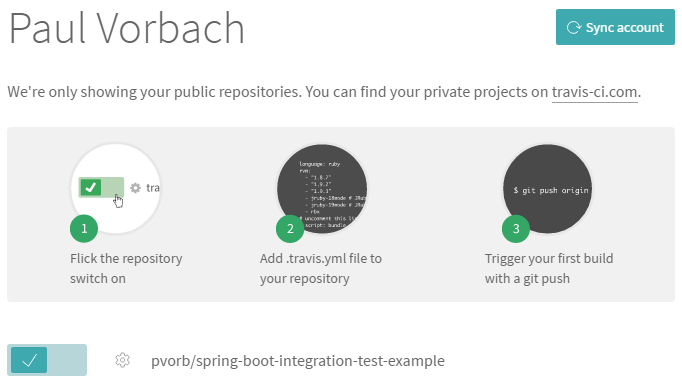
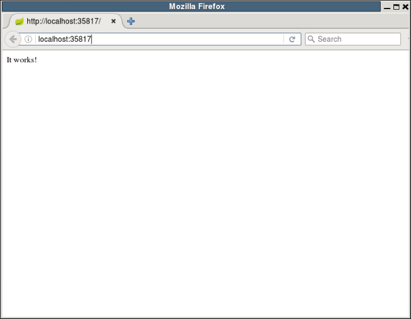

title: Automating Integration Testing of Spring Boot Applications on Travis CI and Sauce Labs
created: 2016-12-01
teaser:
  img: flowers.jpg
  author: j van cise photos
  url: https://www.flickr.com/photos/jvancisephotos/13926392039/
  license:
    name: CC BY 2.0
    url: https://creativecommons.org/licenses/by/2.0/
template: post.diego.en.tpl
tags: [ english, howto, java, spring-boot, maven, testing ]

Writing Unit Tests often is not enough to make sure your software is working correctly. In order to make sure your
components are *integrated* correctly, writing automated *Integration Tests* will help you accomplish that goal.
Unfortunately, setting up a project for automated integration testing is not straight forward. In this article
I'll show how to set up a Spring Boot web application with Maven that automatically runs on Travis CI and connects to
Selenium WebDrivers running on Sauce Labs for testing with real browsers. This is done step-by-step so hopefully it will
be easy for you to follow along and set up integration tests for your own Spring Boot project.

## Prerequisites

You're going to need accounts on [GitHub], [Travis CI] and [Sauce Labs] to follow the instructions in this article. All
of these services are entirely free for open source projects.

[GitHub]: https://github.com/
[Travis CI]: https://travis-ci.org/
[Sauce Labs]: https://saucelabs.com/

## Local setup

In order to help with development and testing the setup, we're first going to set up the environment locally. Let's
start with this simple `pom.xml`:

~~~ xml
<project xmlns="http://maven.apache.org/POM/4.0.0"
        xmlns:xsi="http://www.w3.org/2001/XMLSchema-instance"
        xsi:schemaLocation="http://maven.apache.org/POM/4.0.0 http://maven.apache.org/xsd/maven-4.0.0.xsd">
    <modelVersion>4.0.0</modelVersion>

    <groupId>org.example</groupId>
    <artifactId>webapp</artifactId>
    <version>0.1.0-SNAPSHOT</version>
    <packaging>jar</packaging>

    <parent>
        <groupId>org.springframework.boot</groupId>
        <artifactId>spring-boot-starter-parent</artifactId>
        <version>1.4.2.RELEASE</version>
    </parent>

    <properties>
        <java.version>1.8</java.version>
        <project.build.sourceEncoding>UTF-8</project.build.sourceEncoding>

        <selenium.version>2.53.1</selenium.version>
    </properties>

    <dependencies>
        <dependency>
            <groupId>org.springframework.boot</groupId>
            <artifactId>spring-boot-starter-web</artifactId>
        </dependency>
        <dependency>
            <groupId>org.springframework.boot</groupId>
            <artifactId>spring-boot-starter-test</artifactId>
            <scope>test</scope>
        </dependency>
        <dependency>
            <groupId>org.seleniumhq.selenium</groupId>
            <artifactId>selenium-remote-driver</artifactId>
            <version>${selenium.version}</version>
            <scope>test</scope>
        </dependency>
        <dependency>
            <groupId>org.seleniumhq.selenium</groupId>
            <artifactId>selenium-support</artifactId>
            <version>${selenium.version}</version>
            <scope>test</scope>
        </dependency>
    </dependencies>

    <build>
        <plugins>
            <plugin>
                <groupId>org.springframework.boot</groupId>
                <artifactId>spring-boot-maven-plugin</artifactId>
            </plugin>
        </plugins>
    </build>
</project>

~~~

This is the main application class (`src/main/java/org/example/webapp/WebApp.java`):

~~~ java
package org.example.webapp;

import org.springframework.boot.SpringApplication;
import org.springframework.boot.autoconfigure.SpringBootApplication;

@SpringBootApplication
public class WebApp {

    public static void main(String... args) {
        SpringApplication.run(WebApp.class, args);
    }

}
~~~

And there's also an HTML file we want to navigate our WebDriver to (`src/main/resources/static/index.html`):

~~~ html

It works!

~~~

## Simple integration test

In order to be able to inject a Selenium WebDriver into the test classes, we add a Spring configuration class
(`src/test/java/org/example/webapp/integration/ITConfig.java`):

~~~ java
package org.example.webapp.integration;

import org.openqa.selenium.WebDriver;
import org.openqa.selenium.remote.DesiredCapabilities;
import org.openqa.selenium.remote.RemoteWebDriver;
import org.springframework.beans.factory.annotation.Autowired;
import org.springframework.context.annotation.Bean;
import org.springframework.context.annotation.Configuration;
import org.springframework.core.env.Environment;

import java.net.MalformedURLException;
import java.net.URL;

@Configuration
public class ITConfig {

    @Autowired
    private Environment env;

    @Bean
    public WebDriver webDriver() throws MalformedURLException {
        return new RemoteWebDriver(getRemoteUrl(), getDesiredCapabilities());
    }

    private DesiredCapabilities getDesiredCapabilities() {
        return DesiredCapabilities.firefox();
    }

    private URL getRemoteUrl() throws MalformedURLException {
        return new URL("http://localhost:4445/wd/hub");
    }
}
~~~

Here's a very basic integration test (`src/test/java/org/example/webapp/integration/IndexTest.java`):

~~~ java
package org.example.webapp.integration;

import org.junit.Assert;
import org.junit.Test;
import org.junit.runner.RunWith;
import org.openqa.selenium.By;
import org.openqa.selenium.WebDriver;
import org.openqa.selenium.WebElement;
import org.springframework.beans.factory.annotation.Autowired;
import org.springframework.test.context.ContextConfiguration;
import org.springframework.test.context.junit4.SpringJUnit4ClassRunner;

import static org.hamcrest.Matchers.equalTo;
import static org.hamcrest.Matchers.is;

@RunWith(SpringJUnit4ClassRunner.class)
@ContextConfiguration(classes = ITConfig.class)
public class IndexTest {

    @Autowired
    private WebDriver webDriver;

    @Test
    public void visitIndexPage() throws Exception {

        webDriver.get("http://localhost:8080/");
        WebElement working = webDriver.findElement(By.id("working"));

        Assert.assertThat(working.getText(), is(equalTo("It works!")));
    }
}
~~~

That's everything you need for the integration test itself. In order to run it locally, you'll have to download the
Selenium standalone server (get `selenium-server-standalone-2.53.1.jar` from [here][selenium-downloads]) as well as the
[geckodriver for your platform][geckodriver]. Then put both the geckodriver binary
and the selenium jar in a directory anywhere on your computer and run selenium from a command prompt:

~~~
java -jar selenium-server-standalone-2.53.1.jar -port 4445
~~~

From a separate command prompt, you can now run

~~~
mvn spring-boot:run
~~~

to start the application and

~~~
mvn test
~~~

in a third command prompt. Hopefully, you'll see your test start Firefox after a while an it navigating to
`http://localhost:8080/`.

[selenium-downloads]: http://selenium-release.storage.googleapis.com/index.html?path=2.53/
[geckodriver]: https://github.com/mozilla/geckodriver/releases

## Automating the configuration

The next step on our way is to be able to start our web app and the integration tests in a single command. This can be
achieved using the [maven-failsafe-plugin]. Alter the `build` definition in your `pom.xml` to the following:

~~~ xml
    <build>
        <plugins>
            <plugin>
                <groupId>org.springframework.boot</groupId>
                <artifactId>spring-boot-maven-plugin</artifactId>
                <executions>
                    <execution>
                        <id>pre-integration-test</id>
                        <goals>
                            <goal>start</goal>
                        </goals>
                        <configuration>
                            <arguments>--server.port=${server.port}</arguments>
                        </configuration>
                    </execution>
                    <execution>
                        <id>post-integration-test</id>
                        <goals>
                            <goal>stop</goal>
                        </goals>
                    </execution>
                </executions>
            </plugin>
            <plugin>
                <groupId>org.codehaus.mojo</groupId>
                <artifactId>build-helper-maven-plugin</artifactId>
                <version>1.12</version>
                <executions>
                    <execution>
                        <id>reserve-container-port</id>
                        <goals>
                            <goal>reserve-network-port</goal>
                        </goals>
                        <phase>process-resources</phase>
                        <configuration>
                            <portNames>
                                <portName>server.port</portName>
                            </portNames>
                        </configuration>
                    </execution>
                </executions>
            </plugin>
            <plugin>
                <groupId>org.apache.maven.plugins</groupId>
                <artifactId>maven-failsafe-plugin</artifactId>
                <version>2.18.1</version>
                <configuration>
                    <systemPropertyVariables>
                        <server.port>${server.port}</server.port>
                        <selenium.version>${selenium.version}</selenium.version>
                    </systemPropertyVariables>
                </configuration>
            </plugin>
        </plugins>
    </build>
~~~

Failsafe adds several integration-test phases to the Maven lifecycle. We added an execution to the
spring-boot-maven-plugin that starts the app before integration tests are run. The build-helper-maven-plugin is used to
reserve a free port, so it won't have port collisions if port 8080 is already in use.

Failsafe automatically detects integration tests by their name. All classes under `src/test/java` that end with `IT`
will be executed by Failsafe instead of Surefire. Therefore we must rename the class `IndexTest` to `IndexIT`. Also we
need to dynamically set the port of the requested URL in the test. Here's how the test looks after these changes:

~~~ java
@RunWith(SpringJUnit4ClassRunner.class)
@ContextConfiguration(classes = ITConfig.class)
public class IndexIT {

    @Autowired
    private WebDriver webDriver;

    @Value("${server.port}")
    private int serverPort;

    @Test
    public void visitIndexPage() throws Exception {

        webDriver.get(String.format("http://localhost:%d/", serverPort));
        WebElement working = webDriver.findElement(By.id("working"));

        Assert.assertThat(working.getText(), is(equalTo("It works!")));
    }
}
~~~

Now you should be able to run the integration tests with the following command:

~~~
mvn verify
~~~

[maven-failsafe-plugin]: https://maven.apache.org/surefire/maven-failsafe-plugin/

## Testing continuously

Since programmers are lazy and soon won't want to run these time consuming tests on their own machines, it's time to
configure a CI server to do it for you. Travis CI is a solution that integrates well into GitHub and also has support
to run Selenium tests via Sauce Labs.

First you need to enable the GitHub project in your Travis profile. This should only be one click:

Then you need to set up your project on Sauce Labs. I won't cover this here, but once your project is set up, you will
see your access key in your account settings. This access key is needed to verify the Travis CI server that runs your
tests is allowed to control a Sauce Labs WebDriver. This key shouldn't become publicy visible, so it makes sense to
encrypt it. This can be done by using the Travis CLI tool ([installation instructions][travis.rb installation]).

Encryption is done with the following command:

~~~
travis encrypt "SAUCE_ACCESS_KEY=your-access-key"
~~~

This returns a string that you need for the file `.travis.yml`:

~~~ yaml
language: java

jdk:
  - oraclejdk8

addons:
  sauce_connect:
    username: your-user-name
  jwt:
    secure: your-encrypted-access-key

script:
  mvn verify -B
~~~

Replace `your-user-name` with the name of your Sauce Labs account and `your-encrypted-access-key` with the encrypted
access key string. Additionally, Sauce Labs user name and access key need to be set as environment variables in the
settings of your project as `SAUCE_USERNAME` and `SAUCE_ACCESS_KEY` (unencrypted).

When this is done, our `ITConfig` needs to be modified slightly to provide the `RemoteWebDriver` with a URL that
contains the information of the Sauce Labs account:

~~~ java
@Configuration
public class ITConfig {

    @Autowired
    private Environment env;

    @Bean
    public WebDriver webDriver() throws MalformedURLException {
        return new RemoteWebDriver(getRemoteUrl(), getDesiredCapabilities());
    }

    private DesiredCapabilities getDesiredCapabilities() {

        final DesiredCapabilities capabilities = DesiredCapabilities.firefox();
        if (useSauceLabs()) {
            capabilities.setCapability("tunnel-identifier", env.getProperty("TRAVIS_JOB_NUMBER"));
            capabilities.setCapability("seleniumVersion", env.getProperty("selenium.version"));
        }

        return capabilities;
    }

    private boolean useSauceLabs() {
        return env.getProperty("SAUCE_USERNAME") != null;
    }

    private URL getRemoteUrl() throws MalformedURLException {
        if (useSauceLabs()) {
            return new URL(String.format("http://%s:%s@localhost:4445/wd/hub",
                    env.getProperty("SAUCE_USERNAME"), env.getProperty("SAUCE_ACCESS_KEY")));
        } else {
            return new URL("http://localhost:4445/wd/hub");
        }
    }
}
~~~

Push these changes to GitHub and you're done! You can watch your tests run on Travis and even watch the browser in your
Sauce Lab account.

The complete sources of this sample project are [available on GitHub][git-repo].

Happy testing!

[travis.rb installation]: https://github.com/travis-ci/travis.rb#installation
[git-repo]: https://github.com/pvorb/spring-boot-integration-test-example
